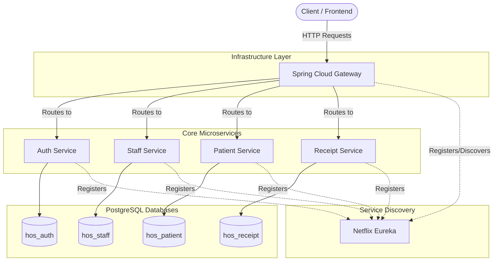

# 🏥 Hospital Management System (Microservices)

A highly scalable, distributed RESTful backend system for managing hospital operations including patients, staff, and billing receipts. Built with **Java 21**, **Spring Boot 3.2**, and **Spring Cloud**, and secured with **JWT Authentication**.

---

## 📸 Demo

> **Demo Placeholder:** *(Replace this image with a GIF of Postman requests, Swagger UI, or application logs to visually demonstrate the API in action!)*


---

## 🏗️ Architecture

This project is built using a **Microservices Architecture**. The monolithic domain has been broken down into independent services communicating through an API Gateway, utilizing a **database-per-service** pattern for true decoupling.



### Microservices:
- 🌐 **API Gateway (`api-gateway`)**: The single entry point for all client requests. Handles dynamic routing and load balancing.
- 🔍 **Discovery Server (`discovery-server`)**: Uses Netflix Eureka for automated service registration and health monitoring.
- 🔐 **Auth Service (`auth-service`)**: Handles user authentication, authorization, and JWT token generation.
- 👨‍⚕️ **Staff Service (`staff-service`)**: Manages hospital staff details and departments.
- 👤 **Patient Service (`patient-service`)**: Manages patient records and medical problems.
- 🧾 **Receipt Service (`receipt-service`)**: Generates and manages billing receipts.
- 📦 **Common Library (`common-lib`)**: A shared Maven module containing reusable DTOs, custom exception handling, and security filters to maintain DRY principles.

---

## 🛠️ Technologies & Tools

| Category | Technology |
|----------|------------|
| **Core** | Java 21, Spring Boot 3.2.5 |
| **Cloud & Routing** | Spring Cloud (2023.0.1), Netflix Eureka, Spring Cloud Gateway |
| **Security** | Spring Security, JWT (JSON Web Tokens) |
| **Database & ORM** | PostgreSQL, Spring Data JPA, Hibernate |
| **DevOps** | Docker, Docker Compose |
| **Build & Utilities** | Maven, Lombok |

---

## 🚀 Features

- ✅ **Microservices Infrastructure** — Fully distributed system with Service Discovery and an API Gateway.
- ✅ **Database-per-Service** — Isolated PostgreSQL databases (`hos_auth`, `hos_patient`, `hos_staff`, `hos_receipt`) managed via Docker Compose.
- ✅ **JWT Security** — Stateless, secure endpoints with token-based authentication.
- ✅ **Role-Based Access Control (RBAC)** — Different access levels based on user roles.
- ✅ **Centralized Exception Handling** — Global exception handlers providing standardized API error responses across all services.

---

## ⚙️ Setup & Installation

### Prerequisites
- Java 21+
- Maven 3.8+
- Docker & Docker Compose

### 1. Clone the repository
```bash
git clone https://github.com/AbhineeT-D7/Hospital-Management-System.git
cd Hospital-Management-System
```

### 2. Start the Databases
The project uses Docker Compose to easily spin up the 4 separate PostgreSQL databases required by the microservices.
```bash
docker-compose up -d
```
*Note: This will start `postgres-auth` (5442), `postgres-patient` (5433), `postgres-staff` (5434), and `postgres-receipt` (5435).*

### 3. Build the Project
Compile the project and install the `common-lib` to your local Maven repository so other services can use it.
```bash
mvn clean install -DskipTests
```

### 4. Run the Microservices
You must start the services in the following order. You can run them using your IDE or via the command line (`mvn spring-boot:run` in each directory):

1. **Discovery Server** (`discovery-server`) - Runs on port `8761`
2. **API Gateway** (`api-gateway`) - Runs on port `8080`
3. **Auth Service** (`auth-service`) - Runs on random/assigned port
4. **Staff Service** (`staff-service`) - Runs on random/assigned port
5. **Patient Service** (`patient-service`) - Runs on random/assigned port
6. **Receipt Service** (`receipt-service`) - Runs on random/assigned port

---

## 📌 API Endpoints

### 🔐 Authentication (`auth-service`)
| Method | Endpoint | Description |
|--------|----------|-------------|
| POST | `/api/user/login` | Authenticate and retrieve JWT token |
| POST | `/api/user/register` | Register a new user |

### 👤 Patient (`patient-service`)
| Method | Endpoint | Description |
|--------|----------|-------------|
| GET | `/api/patients` | Retrieve all patients |
| GET | `/api/patients/{id}` | Retrieve a specific patient by ID |
| POST | `/api/patients` | Add a new patient |
| PUT | `/api/patients/{id}` | Update patient details |
| DELETE | `/api/patients/{id}` | Delete a patient |

### 👨‍⚕️ Staff (`staff-service`)
| Method | Endpoint | Description |
|--------|----------|-------------|
| GET | `/api/staff` | Retrieve all staff members |
| POST | `/api/staff` | Add a new staff member |
| PUT | `/api/staff/{id}` | Update staff details |
| DELETE | `/api/staff/{id}` | Delete a staff member |

### 🩺 Problem (`patient-service`)
| Method | Endpoint | Description |
|--------|----------|-------------|
| GET | `/api/problems` | Retrieve all medical problems |
| POST | `/api/problems` | Log a new medical problem |
| PUT | `/api/problems/{id}` | Update problem status |

### 🧾 Receipt (`receipt-service`)
| Method | Endpoint | Description |
|--------|----------|-------------|
| GET | `/api/receipts` | Retrieve all billing receipts |
| POST | `/api/receipts` | Generate a new billing receipt |

---

## 🔐 Authentication

This API uses **JWT (JSON Web Token)** for authentication.
1. Authenticate via the `auth-service` through the API Gateway to receive a token.
2. Include the token in the `Authorization` header for protected routes:
   ```
   Authorization: Bearer <your_token>
   ```

---

## 🧪 Testing

To run unit tests across all microservices (uses H2 in-memory database):
```bash
mvn test
```

---

## 👤 Author

**Abhineet**
- GitHub: [@AbhineeT-D7](https://github.com/AbhineeT-D7)

---

## 📄 License
This project is open source and available under the [MIT License](LICENSE).
