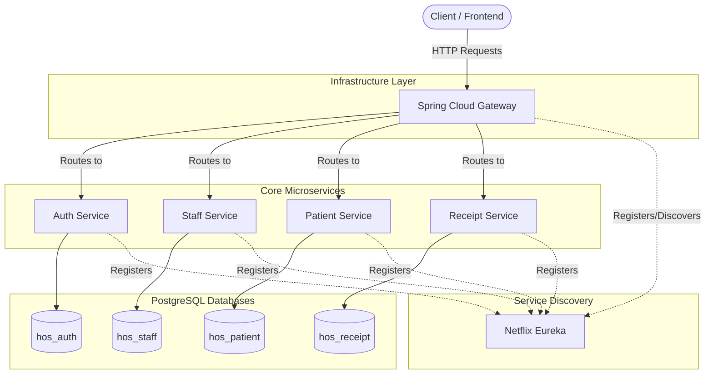

# MedSecure (Hospital Management System)
# Hospital Management System (Microservices)

Hey! Welcome to the repository for **MedSecure**. 

I built this project to challenge myself and dive deep into backend architecture. It originally started out as a standard Spring Boot monolith, but I recently refactored the entire thing into a full **Microservices Architecture** to get hands-on experience with service discovery, API gateways, and distributed data.

## What I Learned Building This
- **Microservices & Spring Cloud:** I broke down the monolithic app into 4 distinct business services. I set up a Netflix Eureka Discovery Server so the services can dynamically find each other, and an API Gateway to act as a single entry point for client requests.
- **Database-per-Service Pattern:** Instead of one giant database, I configured 4 separate PostgreSQL databases. This prevents the services from tangling their data together and forces true decoupling.
- **JWT Zero-Trust Security:** I built a custom `common-lib` library that handles JWT token generation and validation. Every microservice imports this library to authenticate incoming requests statelessly. 

## Architecture  

[Project Architecture](https://via.placeholder.com/800x400.png?text="images\diagram.png")

## How it Works

Here is a quick look at how the traffic flows:


```mermaid
graph TD
    Client([Client / Postman]) -->|HTTP Requests| API_Gateway

    API_Gateway[API Gateway] -->|Routes| AuthService[Auth Service]
    API_Gateway -->|Routes| StaffService[Staff Service]
    API_Gateway -->|Routes| PatientService[Patient Service]
    API_Gateway -->|Routes| ReceiptService[Receipt Service]

    AuthService --> DB_Auth[(hos_auth DB)]
    StaffService --> DB_Staff[(hos_staff DB)]
    PatientService --> DB_Patient[(hos_patient DB)]
    ReceiptService --> DB_Receipt[(hos_receipt DB)]
```
*Note: All core services automatically register with the Eureka Discovery Server on startup.*
### Microservices:
-  **API Gateway (`api-gateway`)**: The single entry point for all client requests. Handles dynamic routing and load balancing.
-  **Discovery Server (`discovery-server`)**: Uses Netflix Eureka for automated service registration and health monitoring.
-  **Auth Service (`auth-service`)**: Handles user authentication, authorization, and JWT token generation.
-  **Staff Service (`staff-service`)**: Manages hospital staff details and departments.
-  **Patient Service (`patient-service`)**: Manages patient records and medical problems.
-  **Receipt Service (`receipt-service`)**: Generates and manages billing receipts.
-  **Common Library (`common-lib`)**: A shared Maven module containing reusable DTOs, custom exception handling, and security filters to maintain DRY principles.

## How to Run it Locally

If you want to spin this up on your own machine, it's pretty straightforward. You need only Java 21 and PostgreSQL to run on your machine .

### 1. Database Setup
Make sure you have PostgreSQL running locally on the default port `5432` (with username: `postgres`, password: `Admin@0000`). 
Create 4 empty databases using pgAdmin, DBeaver, or your terminal:
## Technologies & Tools

## Demo

> **Demo Placeholder:** *(Replace this image with a GIF of Postman requests, Swagger UI, or application logs to visually demonstrate the API in action!)*


---

## Architecture

This project is built using a **Microservices Architecture**. The monolithic domain has been broken down into independent services communicating through an API Gateway, utilizing a **database-per-service** pattern for true decoupling.


```mermaid
graph TD
    Client([Client / Frontend]) -->|HTTP Requests| API_Gateway

    subgraph Service Discovery
        Eureka[Netflix Eureka]
    end

    subgraph Infrastructure Layer
        API_Gateway[Spring Cloud Gateway]
    end

    subgraph Core Microservices
        AuthService[Auth Service]
        StaffService[Staff Service]
        PatientService[Patient Service]
        ReceiptService[Receipt Service]
    end

    subgraph PostgreSQL Databases
        DB_Auth[(hos_auth)]
        DB_Staff[(hos_staff)]
        DB_Patient[(hos_patient)]
        DB_Receipt[(hos_receipt)]
    end

    API_Gateway -->|Routes to| AuthService
    API_Gateway -->|Routes to| StaffService
    API_Gateway -->|Routes to| PatientService
    API_Gateway -->|Routes to| ReceiptService

    AuthService --> DB_Auth
    StaffService --> DB_Staff
    PatientService --> DB_Patient
    ReceiptService --> DB_Receipt

    API_Gateway -.->|Registers/Discovers| Eureka
    AuthService -.->|Registers| Eureka
    StaffService -.->|Registers| Eureka
    PatientService -.->|Registers| Eureka
    ReceiptService -.->|Registers| Eureka
```

### Microservices:
-  *API Gateway (`api-gateway`)**: The single entry point for all client requests. Handles dynamic routing and load balancing.
- **Discovery Server (`discovery-server`)**: Uses Netflix Eureka for automated service registration and health monitoring.
- **Auth Service (`auth-service`)**: Handles user authentication, authorization, and JWT token generation.
- **Staff Service (`staff-service`)**: Manages hospital staff details and departments.
- **Patient Service (`patient-service`)**: Manages patient records and medical problems.
- **Receipt Service (`receipt-service`)**: Generates and manages billing receipts.
- **Common Library (`common-lib`)**: A shared Maven module containing reusable DTOs, custom exception handling, and security filters to maintain DRY principles.

---

## Technologies & Tools

| Category | Technology |
|----------|------------|
| **Core** | Java 21, Spring Boot 3.2.5 |
| **Cloud & Routing** | Spring Cloud (2023.0.1), Netflix Eureka, Spring Cloud Gateway |
| **Security** | Spring Security, JWT (JSON Web Tokens) |
| **Database & ORM** | PostgreSQL, Spring Data JPA, Hibernate |
| **Build & Utilities** | Maven, Lombok |

---

## Features

- **Microservices Infrastructure** — Fully distributed system with Service Discovery and an API Gateway.
- **Database-per-Service** — Isolated PostgreSQL databases (`hos_auth`, `hos_patient`, `hos_staff`, `hos_receipt`) running natively on a local PostgreSQL installation to ensure true microservice data decoupling.
- **Database-per-Service** — Isolated PostgreSQL databases (`hos_auth`, `hos_patient`, `hos_staff`, `hos_receipt`) managed via Docker Compose.
- **JWT Security** — Stateless, secure endpoints with token-based authentication.
- **Role-Based Access Control (RBAC)** — Different access levels based on user roles.
- **Centralized Exception Handling** — Global exception handlers providing standardized API error responses across all services.

---

## Setup & Installation

### Prerequisites
- Java 21+
- Maven 3.8+
- PostgreSQL (running locally on default port 5432)

### 1. Clone the repository
```bash
git clone https://github.com/AbhineeT-D7/Hospital-Management-System.git
cd Hospital-Management-System
```

### 2. Setup the Databases
Open pgAdmin or your preferred database client and create 4 empty databases in your local PostgreSQL server:
- `hos_auth`
- `hos_patient`
- `hos_staff`
- `hos_receipt`

*(Spring Data JPA will automatically create all the necessary tables for you when the apps boot up!)*

### 3. Run the Microservices
Start the services in the following order using your IDE or via the command line (`mvn spring-boot:run` in each directory):

1. **Discovery Server** (`discovery-server`) - Runs on port `3802`
2. **API Gateway** (`api-gateway`) - Runs on port `38021`
3. **Auth Service** (`auth-service`) - Runs on port `38022`
4. **Patient Service** (`patient-service`) - Runs on port `38023`
5. **Receipt Service** (`receipt-service`) - Runs on port `38024`
6. **Staff Service** (`staff-service`) - Runs on port `38025`


## API Endpoints

### Authentication (`auth-service`)
| Method | Endpoint | Description |
|--------|----------|-------------|
| POST | `/api/user/login` | Authenticate and retrieve JWT token |
| POST | `/api/user/register` | Register a new user |

### Patient (`patient-service`)
| Method | Endpoint | Description |
|--------|----------|-------------|
| GET | `/api/patients` | Retrieve all patients |
You must start the services in the following order. You can run them using your
| PUT | `/api/patients/{id}` | Update patient details |
| DELETE | `/api/patients/{id}` | Delete a patient |

### Staff (`staff-service`)
| Method | Endpoint | Description |
|--------|----------|-------------|
| GET | `/api/staff` | Retrieve all staff members |
| POST | `/api/staff` | Add a new staff member |
| PUT | `/api/staff/{id}` | Update staff details |
| DELETE | `/api/staff/{id}` | Delete a staff member |

### Problem (`patient-service`)
| Method | Endpoint | Description |
|--------|----------|-------------|
| GET | `/api/problems` | Retrieve all medical problems |
| POST | `/api/problems` | Log a new medical problem |
| PUT | `/api/problems/{id}` | Update problem status |

### Receipt (`receipt-service`)
| Method | Endpoint | Description |
|--------|----------|-------------|
| GET | `/api/receipts` | Retrieve all billing receipts |
| POST | `/api/receipts` | Generate a new billing receipt |

### 2. Build the Shared Library
Because the microservices share DTOs and Security configs, you need to install the common library to your local Maven cache first:
```bash
cd common-lib
mvn clean install
```

### 3. Start the Services
You need to start the apps in this specific order so the gateway and services can register with Eureka properly. You can just hit "Run" in your IDE for each one:
1. `discovery-server` (Port 3802)
2. `api-gateway` (Port 38021)
3. `auth-service` (Port 38022)
4. `patient-service` (Port 38023)
5. `receipt-service` (Port 38024)
6. `staff-service` (Port 38025)

## Testing the API
Since there's no frontend UI yet, I did manual testing by using **Postman** to test the API endpoints.
All requests should go through the API Gateway on `http://localhost:38021`.

1. **Register:** `POST /api/user/register` (Pass a JSON body with name, username, password, and role)
2. **Login:** `POST /api/user/login` (Returns your JWT token string)
3. **Access Services:** Copy the token and put it in your Postman Authorization tab as a `Bearer Token`. You can now successfully hit secure endpoints like `GET /api/patients` or `POST /api/staff`!

---
*Feel free to reach out or open an issue if you have any questions about the code or architecture!*
=======
---

## Authentication

This API uses **JWT (JSON Web Token)** for authentication.
1. Authenticate via the `auth-service` through the API Gateway to receive a token.
2. Include the token in the `Authorization` header for protected routes:
   ```
   Authorization: Bearer <your_token>
   ```

---

## Author

**Abhineet**
- GitHub: [@AbhineeT-D7](https://github.com/AbhineeT-D7)


## License
This project is open source and available under the [MIT License](LICENSE).
=======
---

## License
This project is open source and available under the [MIT License](LICENSE).
>>>>>>> d19da44731868f184d0c8cd15b9e61c4094144c0
