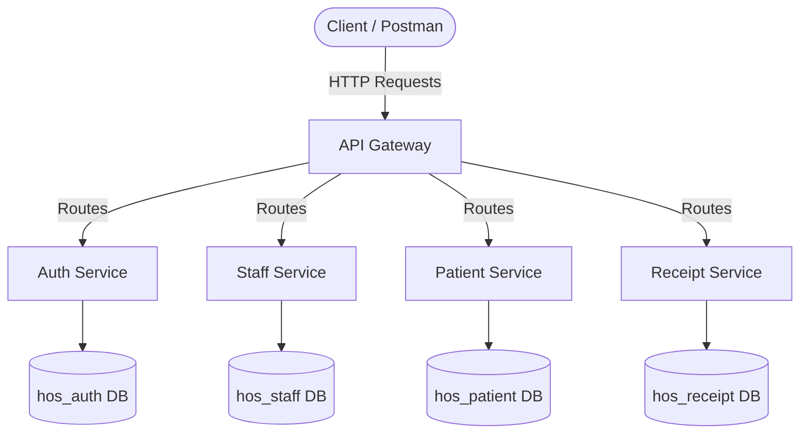

# MedSecure (Hospital Management System)

Hey! Welcome to the repository for **MedSecure**. 

I built this project to challenge myself and dive deep into backend architecture. It originally started out as a standard Spring Boot monolith, but I recently refactored the entire thing into a full **Microservices Architecture** to get hands-on experience with service discovery, API gateways, and distributed data.

## 🧠 What I Learned Building This
- **Microservices & Spring Cloud:** I broke down the monolithic app into 4 distinct business services. I set up a Netflix Eureka Discovery Server so the services can dynamically find each other, and an API Gateway to act as a single entry point for client requests.
- **Database-per-Service Pattern:** Instead of one giant database, I configured 4 separate PostgreSQL databases. This prevents the services from tangling their data together and forces true decoupling.
- **JWT Zero-Trust Security:** I built a custom `common-lib` library that handles JWT token generation and validation. Every microservice imports this library to authenticate incoming requests statelessly. 

## 🏗️ How it Works

Here is a quick look at how the traffic flows:


```mermaid
graph TD
    Client([Client / Postman]) -->|HTTP Requests| API_Gateway

    API_Gateway[API Gateway] -->|Routes| AuthService[Auth Service]
    API_Gateway -->|Routes| StaffService[Staff Service]
    API_Gateway -->|Routes| PatientService[Patient Service]
    API_Gateway -->|Routes| ReceiptService[Receipt Service]

    AuthService --> DB_Auth[(hos_auth DB)]
    StaffService --> DB_Staff[(hos_staff DB)]
    PatientService --> DB_Patient[(hos_patient DB)]
    ReceiptService --> DB_Receipt[(hos_receipt DB)]
```

*Note: All core services automatically register with the Eureka Discovery Server on startup.*

## 🚀 How to Run it Locally

If you want to spin this up on your own machine, it's pretty straightforward. You don't need Docker—just Java 21 and PostgreSQL.

### 1. Database Setup
Make sure you have PostgreSQL running locally on the default port `5432` (with username: `postgres`, password: `Admin@0000`). 
Create 4 empty databases using pgAdmin, DBeaver, or your terminal:
- `hos_auth`
- `hos_patient`
- `hos_staff`
- `hos_receipt`

*(Spring Data JPA will automatically create all the necessary tables for you when the apps boot up!)*

### 2. Build the Shared Library
Because the microservices share DTOs and Security configs, you need to install the common library to your local Maven cache first:
```bash
cd common-lib
mvn clean install
```

### 3. Start the Services
You need to start the apps in this specific order so the gateway and services can register with Eureka properly. You can just hit "Run" in your IDE for each one:
1. `discovery-server` (Port 3802)
2. `api-gateway` (Port 38021)
3. `auth-service` (Port 38022)
4. `patient-service` (Port 38023)
5. `receipt-service` (Port 38024)
6. `staff-service` (Port 38025)

## 🧪 Testing the API
Since there's no frontend UI yet, I use **Postman** to test the endpoints.
All requests should go through the API Gateway on `http://localhost:38021`.

1. **Register:** `POST /api/user/register` (Pass a JSON body with name, username, password, and role)
2. **Login:** `POST /api/user/login` (Returns your JWT token string)
3. **Access Services:** Copy the token and put it in your Postman Authorization tab as a `Bearer Token`. You can now successfully hit secure endpoints like `GET /api/patients` or `POST /api/staff`!

---
*Feel free to reach out or open an issue if you have any questions about the code or architecture!*
